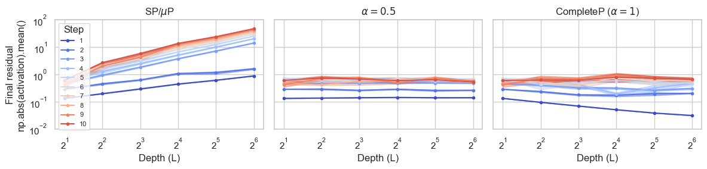

# CompleteP Depth Coordinate Check Reproduction

This folder contains code to reproduce Figure 6 and 7 from [Don't be lazy: CompleteP enables compute-efficient deep transformers](https://arxiv.org/abs/2505.01618). 

### Relative distance from linearization (Figure 6)


### Depth coordinate check(Figure 7)

To reproduce this figure yourself, first download the tiny shakespeare dataset by running `python data/shakespeare_char/prepare.py`.

Then to collect the results for the depth coordinate check run:
```
bash completep_examples/coord_check_shakespeare_char/depth_alpha_1_aka_completep/run.sh
bash completep_examples/coord_check_shakespeare_char/depth_alpha_05/run.sh
bash completep_examples/coord_check_shakespeare_char/sp_and_mup/run.sh
```

Finally `completep_examples/coord_check_shakespeare_char/plot.ipynb` contains the code to produce the following figure:

